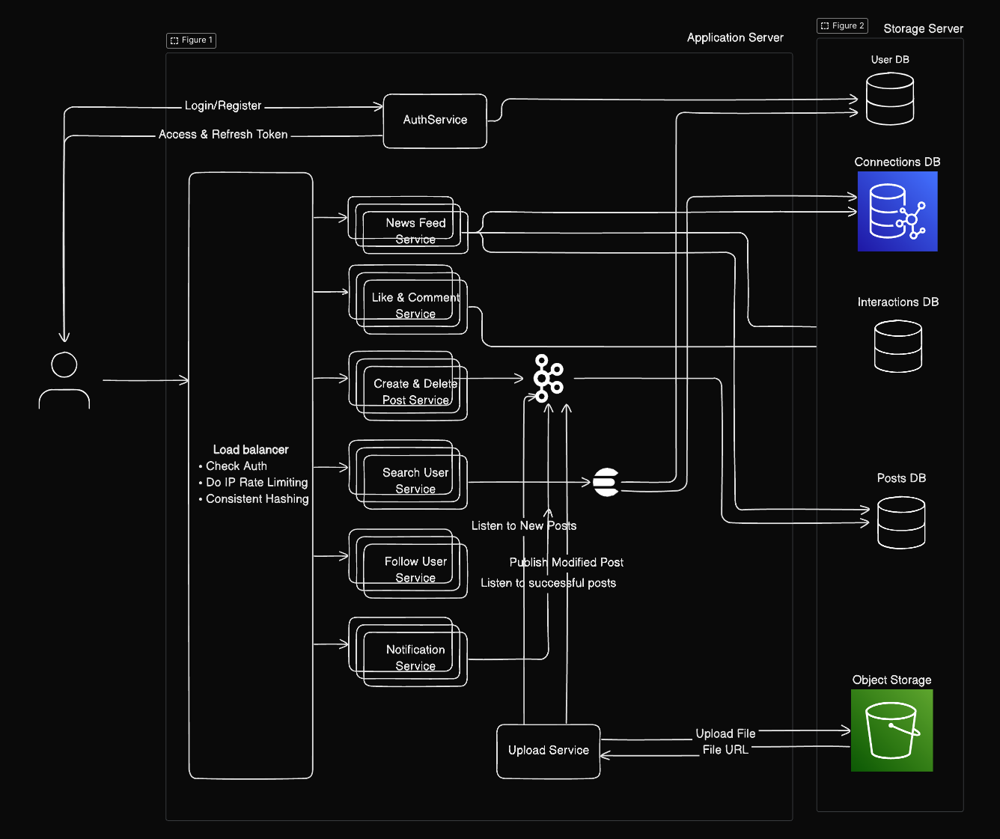

# Social Sphere

### Description

Social Sphere a simple social media application where users can interact with posting some content

### Tech Stack

**Backend**

-   ExpressJS
-   MongoDB
-   Kafka
-   S3 Object Storage
-   EC2 Hosting using Nginx server

**Frontend**

-   ReactJS
-   Redux State Management
-   React Router DOM for routing

## 1. Functional Requirements

1. Register/Login
2. Create/Update/Delete Profile
3. View Feed
4. Create/Delete a Post
5. Like/Comment on a post
6. Search Users
7. Follow/unfollow users

## 2. Non Functional Requirements

## 3. Capacity Estimations

## 4. Database Design

**User Table**

| column     | type     | other |
| ---------- | -------- | ----- |
| username   | String   | PK    |
| firstname  | String   | req   |
| lastname   | String   |       |
| email      | String   | req   |
| phone_num  | numeric  |       |
| last_login | DateTime | def   |
| created_at | DateTime | def   |
| updated_at | DateTime | def   |

**Connections table (Use Graph DB)**

| column      | type       | other |
| ----------- | ---------- | ----- |
| follower_id | FK (users) | req   |
| followee_id | FK (users) | req   |
| created_at  | DateTime   | def   |

**Posts Table**

| column      | type       | other |
| ----------- | ---------- | ----- |
| post_id     | UUID       | PK    |
| username    | FK (users) | req   |
| description | String     |       |
| url         | string     |       |
| likes       | number     | def 0 |
| created_at  | DateTime   | def   |
| updated_at  | DateTime   | def   |

**Likes Table**

| column        | type               | other |
| ------------- | ------------------ | ----- |
| activity_type | ENUM(comment,post) |       |
| activity_id   | FK (posts)         | req   |
| username      | FK (users)         | req   |
| created_at    | DateTime           | def   |
| updated_at    | DateTime           | def   |

**Comments Table**

| column     | type       | other |
| ---------- | ---------- | ----- |
| post_id    | FK (posts) | req   |
| username   | FK (users) | req   |
| text       | String     | req   |
| likes      | number     | def 0 |
| created_at | DateTime   | def   |
| updated_at | DateTime   | def   |

## 5. API's

## 6. High Level Design

